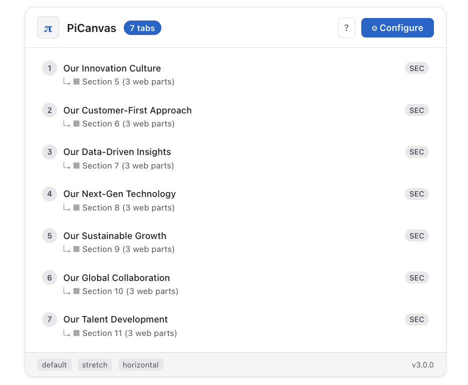
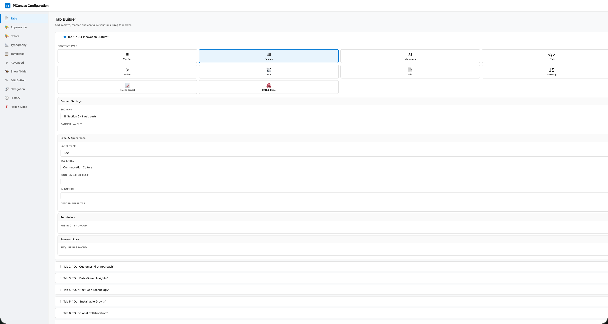
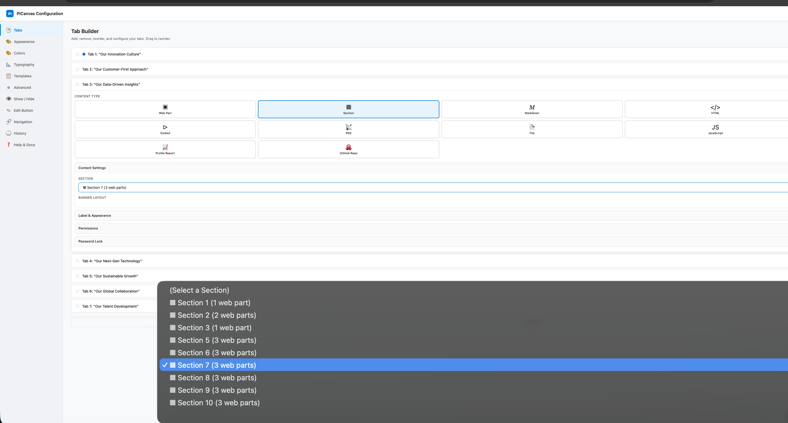
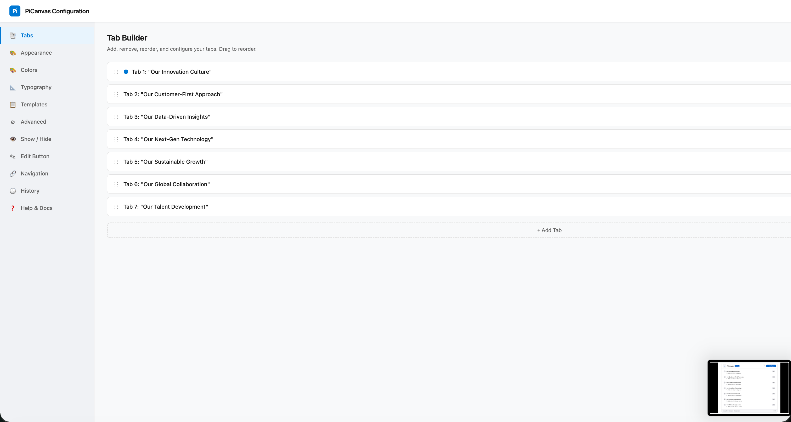

# PiCanvas


A single SPFx web part that replaces custom development. PiCanvas renders full-page portals, data-driven dashboards, and enterprise search interfaces — all inside SharePoint, using the logged-in user's identity and permissions. Its JavaScript sandbox has authenticated access to Microsoft Graph and the full M365 ecosystem — files, sites, mail, calendar, Teams, people, Copilot APIs — scoped to whatever permissions your tenant has granted. No Azure Functions, no external databases, no additional servers.

> What started as a tabbed layout web part has become something else entirely. At SAP, PiCanvas powers a 22,000-company intelligence platform with 14 report types loaded in parallel, a full intranet portal with list-driven navigation and custom theming, and a Copilot-integrated search interface — all from a single `.sppkg` package.

| Edit Mode | Configuration Panel |
|---|---|
|  |  |



### What People Build With It

- **Full intranet portals** — custom HTML/CSS pages with hierarchical navigation rendered from SharePoint lists, responsive themes, and live RSS feeds. Replaces the entire SharePoint page chrome.
- **Enterprise data applications** — JavaScript sandbox with authenticated `graphFetch` queries SharePoint lists (22,000+ items with pagination), Microsoft Graph, and Copilot APIs. Renders company profiles, financial dashboards, and search interfaces.
- **Intelligence platforms** — 14 built-in report types (growth profiles, competitive landscapes, earnings summaries) loaded in parallel from document libraries with automatic fallback paths.
- **Documentation & knowledge hubs** — Markdown with syntax highlighting, Mermaid architecture diagrams, auto-generated TOC, GitHub repo rendering via API.
- **Admin interfaces** — built-in content management UI with navigation tree editors, bulk operations, and status tracking.
- **Tabbed pages** — the original use case. Organize web parts, sections, and content types into a clean tabbed experience with 4 styles, vertical/horizontal orientation, and deep linking.

---

## 12 Content Types

Each tab renders its own content type independently. Everything runs inside the SPFx package — no external services required.

| Content Type | What It Does |
|---|---|
| **Web Part** | Any native SharePoint web part inside a tab |
| **Section** | Entire multi-column SharePoint sections grouped into tabs |
| **Markdown** | GitHub Flavored Markdown with syntax highlighting |
| **HTML** | Sanitized HTML content (DOMPurify-protected) |
| **Mermaid** | Diagrams, flowcharts, and architecture visualizations |
| **Embed** | iframes for YouTube, Power BI, Forms, Vimeo — with domain allowlist |
| **RSS** | Feed reader with list, card, and compact layouts |
| **File** | External .html or .md files from SharePoint document libraries |
| **JavaScript** | Custom scripts with a sandboxed API (graphFetch, httpFetch, ECharts) |
| **TOC** | Auto-generated Table of Contents from page headings |
| **Profile Report** | Company intelligence dashboards powered by SharePoint lists |
| **GitHub** | Native GitHub repo rendering via API |

### In Action

| RSS Feed | GitHub Renderer | Copilot Search (JavaScript) |
|----------|----------------|-----------------------------|
|  |  |  |

---

## Configuration Panel

PiCanvas replaces the standard property pane with a full-screen configuration overlay. Tab builder with drag-and-drop, live preview, color engine, typography controls, template system, and a command palette (Cmd+K).

| Tab Builder | Content Types & Settings | Templates |
|-------------|--------------------------|-----------|
|  |  |  |

| Colors | Typography | Permissions |
|--------|------------|-------------|
|  |  |  |

---

## Key Features

**Content & Rendering**
- 12 content types — each tab is its own rendering engine
- JavaScript sandbox with `graphFetch` (Microsoft Graph), `httpFetch`, ECharts, and DOM APIs
- Markdown with syntax highlighting, Mermaid diagrams, RSS feeds with card/list/compact layouts
- GitHub repo rendering via API (built when GitHub blocked iframe embedding via CSP)
- HTML content sanitized through DOMPurify — no `<script>` tags, no event handlers

**Permissions & Security**
- Show/hide tabs by SharePoint group (Owners, Members, Visitors, custom groups)
- Password-protected tabs with hashed passwords and customizable lock screens
- CSP-compliant — all dependencies bundled in the .sppkg, no external CDN scripts
- Embed domain allowlist with HTTPS enforcement

**Navigation & Layout**
- 4 tab styles (Default, Pills, Underline, Boxed) with horizontal and vertical orientation
- Up to 20 tabs per instance, multiple instances per page
- Deep linking via URL hash, web-part-as-label, tab dividers, image labels
- Application customizer extension pre-hides content before render (no flash of unstyled content)

**Configuration & Templates**
- Full-screen configuration panel with drag-and-drop tab builder, command palette (Cmd+K), undo/redo
- Export/import full configurations as JSON, save to Site Assets for team sharing
- Auto light/dark theme detection with 25+ CSS custom properties
- Built-in templates: Dashboard, Documentation, Portal Hub, Navigation Dock, Minimal

**Platform**
- SPFx 1.22.0, TypeScript 5.6, Heft build system
- Service architecture: content rendering, permissions, theming, templates, tab locking, metadata tokens, RSS, TOC
- In production at SAP — intranet portals, full-stack applications, data dashboards

---

## Installation

### Prerequisites

- SharePoint Online or SharePoint 2019+
- Site Collection App Catalog or Tenant App Catalog
- Site Collection Administrator permissions

### Build & Deploy

```bash
npm install
npm run package
```

Upload `sharepoint/solution/pi-canvas.sppkg` to your App Catalog, click **Deploy**, then add the app from Site Contents.

#### Lite variant

If you only want the PiCanvas web part itself (no AA Hub, no PiRadar Command), build the lite variant instead:

```bash
npm run package:lite
```

Outputs `sharepoint/solution/pi-canvas-lite.sppkg` with its own solution + component IDs so it can coexist tenant-wide with the full package. Best for site collections that just need tabbed layouts. Note: lite and full use different PiCanvas component IDs — pages built with one don't render PiCanvas under the other without rewriting the page's CanvasContent (see `scripts/migrate-picanvas-componentid.js`).

### Guest User Access

Guest users require deployment to a **Site Collection App Catalog** (not the Tenant App Catalog) because they cannot access tenant-level CDN resources.

```powershell
# Enable site collection app catalog
Connect-SPOService -Url https://yourtenant-admin.sharepoint.com
Add-SPOSiteCollectionAppCatalog -Site https://yourtenant.sharepoint.com/sites/yoursite
```

---

## Development

```bash
# Install dependencies
npm install

# Start dev server (serves debug manifests on https://localhost:4321)
npm run serve

# Build for production
npx heft build --production
```

Edit `config/serve.json` to set your SharePoint site URL for local testing.

### Project Structure

```
src/
  webparts/piCanvas/
    PiCanvasWebPart.ts              # Main web part
    configPanel/                    # Full-screen configuration panel
      ConfigurationPanel.ts         # Panel overlay, sidebar, undo/redo
      controls/                     # Dropdown, toggle, slider, color picker, command palette
      sections/                     # Tab Builder, Appearance, Colors, Typography, Templates, Advanced, Help
    services/                       # Content rendering, RSS, TOC, themes, templates, metadata tokens
    models/                         # Template models, JavaScript templates
    assets/                         # HTML templates, fonts
    loc/                            # Localization
  extensions/piCanvasLoader/        # Application customizer (pre-hide, banner fix)
config/                             # SPFx configuration
docs/                               # Documentation and images
```

---

## JavaScript Sandbox API

When a tab's content type is **JavaScript**, PiCanvas executes the code with these APIs:

| Variable | Description |
|----------|-------------|
| `container` | DOM element for the tab's content area |
| `render(html)` | Renders HTML into the container |
| `graphFetch(url, options)` | Authenticated Microsoft Graph API calls (runs as the logged-in user) |
| `httpFetch(url, options)` | General HTTP requests via SPHttpClient |
| `create(tag)` | Shorthand for `document.createElement` |
| `echarts` | Apache ECharts library |
| `autoResize()` | Triggers container height recalculation |

```javascript
// Current user's profile
var me = await graphFetch('/v1.0/me');

// Search across all of M365
var results = await graphFetch('/v1.0/search/query', {
  method: 'POST',
  body: { requests: [{ entityTypes: ['driveItem', 'listItem', 'site'], query: { queryString: 'budget report' } }] }
});

// Copilot Search (semantic + lexical hybrid)
var ai = await graphFetch('/beta/copilot/search', {
  method: 'POST',
  body: { query: 'quarterly revenue trends', scopes: ['onedrive'] }
});
```

### How Permissions Work

`graphFetch` uses the **[SharePoint Online Client Extensibility](https://learn.microsoft.com/en-us/sharepoint/dev/spfx/use-aadhttpclient)** service principal — a tenant-wide Entra ID application that all SPFx solutions share. API scopes must be approved by a tenant admin via the **[API Access page](https://learn.microsoft.com/en-us/sharepoint/api-access)** in SharePoint Admin Center (`{tenant}-admin.sharepoint.com` > Advanced > API management).

| Scope | What It Unlocks |
|-------|----------------|
| `Sites.Read.All` | Read SharePoint sites, lists, document libraries |
| `Files.Read.All` | Read files across OneDrive and SharePoint |
| `User.Read` | Current user's profile |
| `People.Read` | People search and org chart |
| `Mail.Read` | Email access |
| `Calendars.Read` | Calendar events |
| `ExternalItem.Read.All` | Microsoft Search connectors |

For scopes not available through the SPFx service principal (e.g., Copilot APIs, third-party services, or fine-grained consent), you can use your own **[Entra ID app registration](https://learn.microsoft.com/en-us/sharepoint/dev/spfx/use-aadhttpclient-enterpriseapi)** and acquire tokens via `AadHttpClient` in your JavaScript code.

> **See also:** [Building SPFx solutions with Microsoft Graph](https://learn.microsoft.com/en-us/sharepoint/dev/spfx/web-parts/get-started/using-microsoft-graph-apis) — step-by-step guide for requesting and approving Graph API permissions.

---

## CSP Compliance

SharePoint Online enforces Content Security Policy for script sources starting March 2026. **PiCanvas is CSP-compliant out of the box** — all dependencies are bundled in the .sppkg, no external CDN scripts, no `SPComponentLoader.loadScript()`, no inline `<script>` tags. No entries needed in Trusted Script Sources.

---

## Credits

Originally inspired by [Mark Rackley's Hillbilly Tabs](http://www.markrackley.net/2022/06/29/the-return-of-hillbilly-tabs/) (SPFx 1.13, 2021). PiCanvas has since been completely rewritten. Built by [@anthonyrhopkins](https://linkedin.com/in/anthonyrhopkins).

## License

MIT
