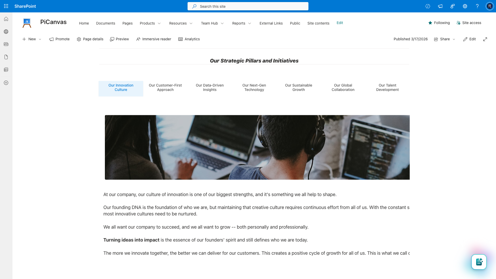
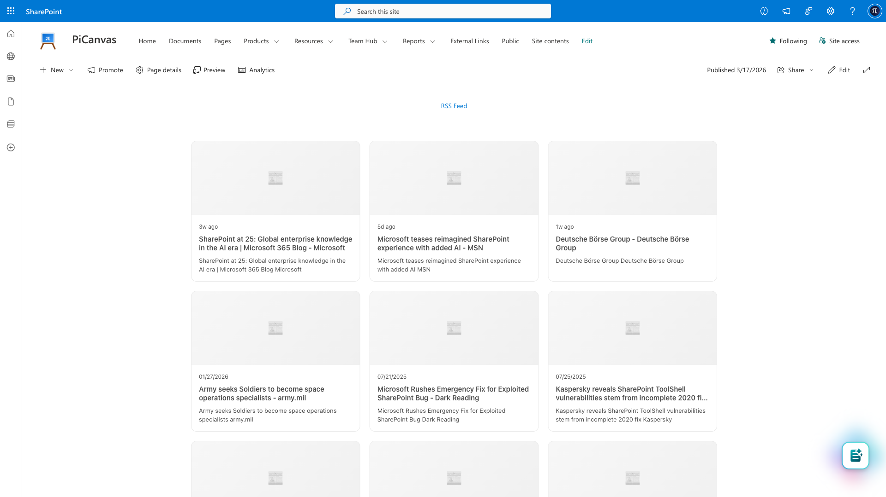
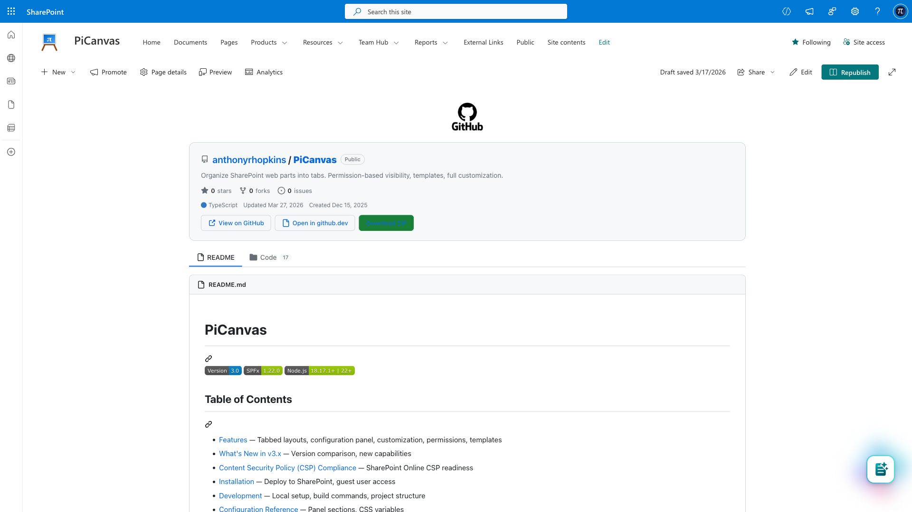
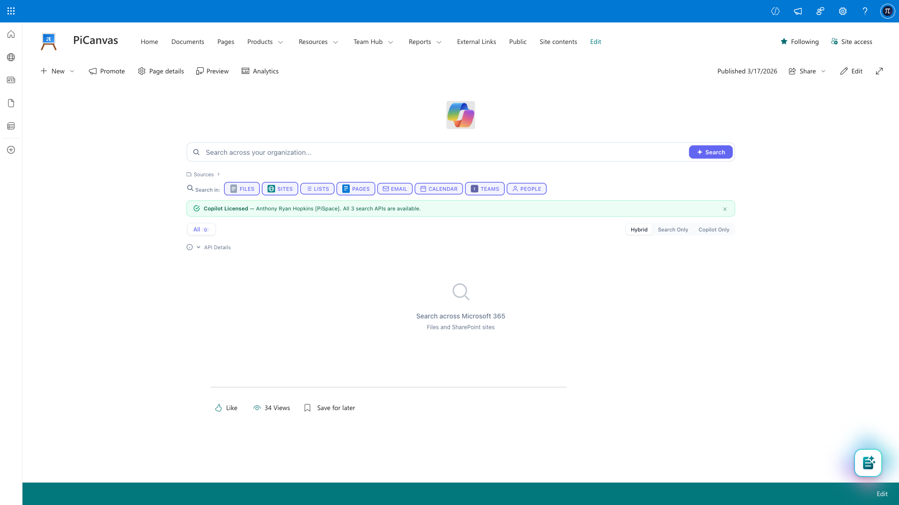

# PiCanvas


A single SPFx web part that turns SharePoint pages into applications. 12 built-in content types, a JavaScript sandbox with authenticated Graph API access, group-based permissions, and a full-screen configuration panel — no Azure Functions, no external databases, no additional servers.

> What started as a tabbed layout web part has become a content platform. PiCanvas renders Markdown, HTML, RSS, Mermaid diagrams, and GitHub repos natively — and its JavaScript sandbox runs custom code with the logged-in user's identity, authenticated Graph API access, and full SharePoint context. The tabs are just how you organize it.



### What You Can Build

- **Intranet portals** — HTML/CSS landing pages with live navigation, RSS feeds, and embedded resources
- **Data applications** — JavaScript tabs that query SharePoint lists and Microsoft Graph to render dashboards, reports, and search interfaces
- **Documentation hubs** — Markdown, Mermaid diagrams, auto-generated TOC, and GitHub repo content — all in one page
- **Full-stack apps on SharePoint** — lists as database, document libraries as file system, PiCanvas as frontend. Zero external infrastructure.
- **Tabbed pages** — organize web parts, sections, and content into a clean navigation experience

---

## 12 Content Types

Each tab renders its own content type independently. Everything runs inside the SPFx package — no external services required.

| Content Type | What It Does |
|---|---|
| **Web Part** | Any native SharePoint web part inside a tab |
| **Section** | Entire multi-column SharePoint sections grouped into tabs |
| **Markdown** | GitHub Flavored Markdown with syntax highlighting |
| **HTML** | Sanitized HTML content (DOMPurify-protected) |
| **Mermaid** | Diagrams, flowcharts, and architecture visualizations |
| **Embed** | iframes for YouTube, Power BI, Forms, Vimeo — with domain allowlist |
| **RSS** | Feed reader with list, card, and compact layouts |
| **File** | External .html or .md files from SharePoint document libraries |
| **JavaScript** | Custom scripts with a sandboxed API (graphFetch, httpFetch, ECharts) |
| **TOC** | Auto-generated Table of Contents from page headings |
| **Profile Report** | Company intelligence dashboards powered by SharePoint lists |
| **GitHub** | Native GitHub repo rendering via API |

### In Action

| RSS Feed | GitHub Renderer | Copilot Search (JavaScript) |
|----------|----------------|-----------------------------|
|  |  |  |

---

## Configuration Panel

PiCanvas replaces the standard property pane with a full-screen configuration overlay. Tab builder with drag-and-drop, live preview, color engine, typography controls, template system, and a command palette (Cmd+K).

| Tab Builder | Expanded Settings | Templates |
|-------------|-------------------|-----------|
|  |  |  |

| Colors | Typography | Permissions |
|--------|------------|-------------|
|  |  |  |

---

## Key Features

**Content & Rendering**
- 12 content types — each tab is its own rendering engine
- JavaScript sandbox with `graphFetch` (Microsoft Graph), `httpFetch`, ECharts, and DOM APIs
- Markdown with syntax highlighting, Mermaid diagrams, RSS feeds with card/list/compact layouts
- GitHub repo rendering via API (built when GitHub blocked iframe embedding via CSP)
- HTML content sanitized through DOMPurify — no `<script>` tags, no event handlers

**Permissions & Security**
- Show/hide tabs by SharePoint group (Owners, Members, Visitors, custom groups)
- Password-protected tabs with hashed passwords and customizable lock screens
- CSP-compliant — all dependencies bundled in the .sppkg, no external CDN scripts
- Embed domain allowlist with HTTPS enforcement

**Navigation & Layout**
- 4 tab styles (Default, Pills, Underline, Boxed) with horizontal and vertical orientation
- Up to 20 tabs per instance, multiple instances per page
- Deep linking via URL hash, web-part-as-label, tab dividers, image labels
- Application customizer extension pre-hides content before render (no flash of unstyled content)

**Configuration & Templates**
- Full-screen configuration panel with drag-and-drop tab builder, command palette (Cmd+K), undo/redo
- Export/import full configurations as JSON, save to Site Assets for team sharing
- Auto light/dark theme detection with 25+ CSS custom properties
- Built-in templates: Dashboard, Documentation, Portal Hub, Navigation Dock, Minimal

**Platform**
- SPFx 1.22.0, TypeScript 5.6, Heft build system
- Service architecture: content rendering, permissions, theming, templates, tab locking, metadata tokens, RSS, TOC
- In production at SAP — intranet portals, full-stack applications, data dashboards

---

## Installation

### Prerequisites

- SharePoint Online or SharePoint 2019+
- Site Collection App Catalog or Tenant App Catalog
- Site Collection Administrator permissions

### Build & Deploy

```bash
npm install
npx heft build --production
npx heft package-solution --production
```

Upload `sharepoint/solution/pi-canvas.sppkg` to your App Catalog, click **Deploy**, then add the app from Site Contents.

### Guest User Access

Guest users require deployment to a **Site Collection App Catalog** (not the Tenant App Catalog) because they cannot access tenant-level CDN resources.

```powershell
# Enable site collection app catalog
Connect-SPOService -Url https://yourtenant-admin.sharepoint.com
Add-SPOSiteCollectionAppCatalog -Site https://yourtenant.sharepoint.com/sites/yoursite
```

---

## Development

```bash
# Install dependencies
npm install

# Start dev server (serves debug manifests on https://localhost:4321)
npm run serve

# Build for production
npx heft build --production
```

Edit `config/serve.json` to set your SharePoint site URL for local testing.

### Project Structure

```
src/
  webparts/piCanvas/
    PiCanvasWebPart.ts              # Main web part
    configPanel/                    # Full-screen configuration panel
      ConfigurationPanel.ts         # Panel overlay, sidebar, undo/redo
      controls/                     # Dropdown, toggle, slider, color picker, command palette
      sections/                     # Tab Builder, Appearance, Colors, Typography, Templates, Advanced, Help
    services/                       # Content rendering, RSS, TOC, themes, templates, metadata tokens
    models/                         # Template models, JavaScript templates
    assets/                         # HTML templates, fonts
    loc/                            # Localization
  extensions/piCanvasLoader/        # Application customizer (pre-hide, banner fix)
config/                             # SPFx configuration
docs/                               # Documentation and images
```

---

## JavaScript Sandbox API

When a tab's content type is **JavaScript**, PiCanvas executes the code with these APIs:

| Variable | Description |
|----------|-------------|
| `container` | DOM element for the tab's content area |
| `render(html)` | Renders HTML into the container |
| `graphFetch(url, options)` | Authenticated Microsoft Graph API calls via SPFx |
| `httpFetch(url, options)` | General HTTP requests via SPHttpClient |
| `create(tag)` | Shorthand for `document.createElement` |
| `echarts` | Apache ECharts library |
| `autoResize()` | Triggers container height recalculation |

```javascript
// Example: fetch current user from Microsoft Graph
var me = await graphFetch('/v1.0/me');
render('<h2>Hello, ' + me.displayName + '</h2>');

// Example: Graph Search API
var results = await graphFetch('/v1.0/search/query', {
  method: 'POST',
  body: { requests: [{ entityTypes: ['driveItem'], query: { queryString: 'budget' } }] }
});
```

---

## CSP Compliance

SharePoint Online enforces Content Security Policy for script sources starting March 2026. **PiCanvas is CSP-compliant out of the box** — all dependencies are bundled in the .sppkg, no external CDN scripts, no `SPComponentLoader.loadScript()`, no inline `<script>` tags. No entries needed in Trusted Script Sources.

---

## Credits

Originally inspired by [Mark Rackley's Hillbilly Tabs](http://www.markrackley.net/2022/06/29/the-return-of-hillbilly-tabs/) (SPFx 1.13, 2021). PiCanvas has since been completely rewritten. Built by [@anthonyrhopkins](https://linkedin.com/in/anthonyrhopkins).

## License

MIT
