# PiCanvas Documentation

> This documentation mirrors the in-app help available when editing PiCanvas. Click any feature card in edit mode to see these guides directly in SharePoint.

## Quick Links

| Guide | Description |
|-------|-------------|
| [Tabbed Layouts](#tabbed-layouts) | Organize web parts into clean, navigable tabs |
| [Section Support](#section-support) | Group entire page sections into single tabs |
| [Theme Aware](#theme-aware) | Automatically adapts to light and dark modes |
| [Permission-Based Visibility](#permission-based-visibility) | Control tab visibility based on group membership |
| [Content Types](#content-types) | Markdown, HTML, Embed, and Mermaid diagrams |
| [Installation](#installation) | Deploy to SharePoint |
| [Architecture & Deployment](#architecture--deployment) | How PiCanvas works under the hood |
| [Troubleshooting](#troubleshooting) | Common issues and solutions |

---

## Tabbed Layouts

Organize web parts into clean, navigable tabs.

### How It Works

PiCanvas dynamically restructures your SharePoint page to create a tabbed experience. When you assign web parts to tabs, PiCanvas identifies them in your section, creates tab navigation with your custom labels, and moves content into tab panels that show/hide based on selection.

### Tab Orientation

| Option | Description |
|--------|-------------|
| **Horizontal** (default) | Tabs appear at the top of the content |
| **Vertical** | Tabs appear on the left or right side |

When using **Vertical** orientation, additional options appear:
- **Vertical Tab Position** - Left side or Right side
- **Vertical Tab Width** - 150px to 300px, or 25%/33% of container

### Configuration Options

| Option | Values | Description |
|--------|--------|-------------|
| Tab Style | `default`, `pills`, `underline`, `boxed` | Visual appearance of tab buttons |
| Tab Alignment | `left`, `center`, `right`, `stretch` | Horizontal positioning of tabs |
| Tab Count | 1-20 | Number of tabs in your layout |
| Label Image Size | `40px` to `120px`, or `No limit` | Max height for images used as tab labels |

### Tab Label Options

Each tab supports two label types:

#### 1. Text Labels (default)
- Enter any text as the tab label
- Built-in **icon picker** with 30+ emoji icons (🏠 📅 📄 📊 ⚙️ etc.)
- Optional **tab image URL** with position options (left, right, top, background)
- Empty labels default to "Tab 1", "Tab 2", etc.

#### 2. Web Part as Label
- Select **"Use web part as label"** from the Label Type dropdown
- Choose any web part (Image, Text, etc.) to become the tab label
- Perfect for using logos, icons, or rich content as tab headers
- **Label Image Size** controls the max height of images in web part labels
- Select **"No limit (full size)"** to let images fill their tab container

### Tab Dividers

Add visual separators between tabs to create logical groupings:
- Enable **"Add divider after this tab"** toggle for any tab
- Dividers appear as subtle gradient lines between tabs
- Works in both horizontal and vertical orientations

### Visual Structure

```
Horizontal Layout:
┌─────────────────────────────────────────────────────────┐
│  [Tab 1]  [Tab 2] │ [Tab 3]                             │
├─────────────────────────────────────────────────────────┤
│   Web Part Content (dynamically shown/hidden)           │
└─────────────────────────────────────────────────────────┘

Vertical Layout:
┌──────────┬──────────────────────────────────────────────┐
│ [Tab 1]  │                                              │
│ [Tab 2]  │   Web Part Content                           │
│ ──────── │   (dynamically shown/hidden)                 │
│ [Tab 3]  │                                              │
└──────────┴──────────────────────────────────────────────┘
```

### Configuration Panel

The full-screen configuration panel provides all tab and styling settings in one place:

| Tab Builder | Expanded Tab Settings |
|-------------|----------------------|
| 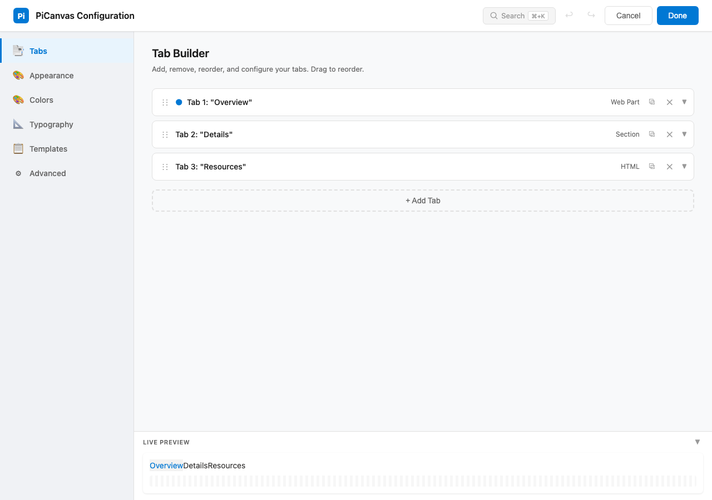 | 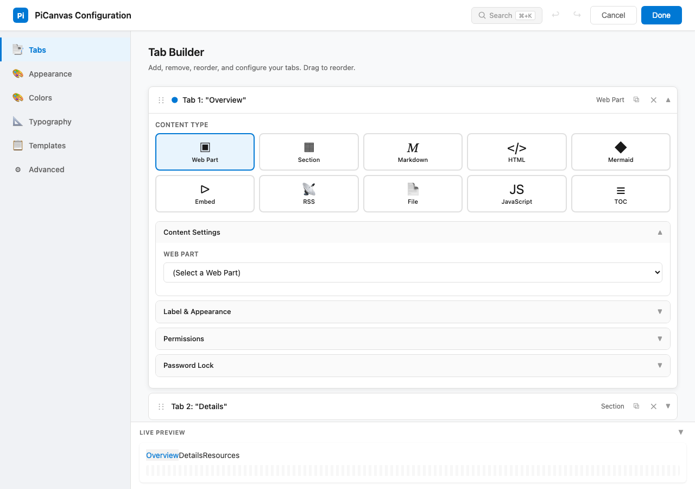 |

| Appearance | Templates |
|------------|-----------|
| 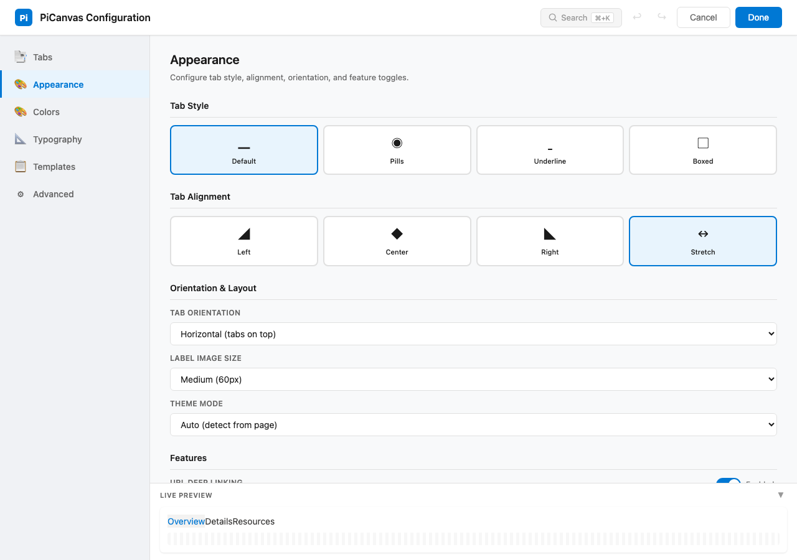 | 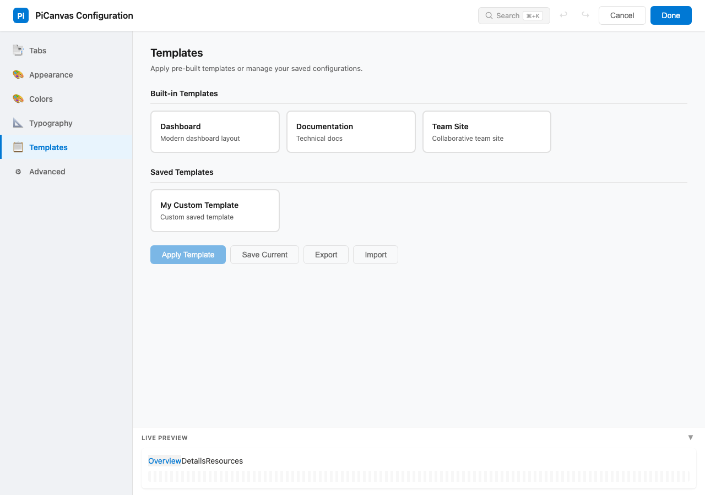 |

### How to Configure

1. Click **Configure** on the edit-mode summary card (or click any tab row to jump to that tab)
2. In the **Tabs** section, click **Add Tab** for each tab you need
3. Select a content type and assign a web part, section, or built-in content
4. Choose label type: Text or Web Part
5. For text labels: enter text and optionally add icons/images
6. For web part labels: select the web part to use as the label
7. Optionally enable dividers between tabs
8. Adjust **Label Image Size** if using images
9. Click **Done** to save (or **Cancel** to discard all changes)

### Edit Mode Compact View

When you edit a SharePoint page, PiCanvas displays a compact summary card instead of the full tabbed layout. This gives page authors a quick overview without taking up space.

```
┌──────────────────────────────────────────────────────────┐
│  π  PiCanvas          6 tabs          [?]  [⚙ Configure] │
├──────────────────────────────────────────────────────────┤
│  1  Dashboard Overview            WP                     │
│     ↳ Sec 1 | Left | Text: "Welcome to..."              │
│  2  Org Chart                     DIA  🔒                │
│     ↳ Mermaid · 245 chars                                │
│  3  News Feed                     RSS                    │
│     ↳ https://intranet.com/feed.xml · cards · 10 items   │
│  4  Help Docs                     HTML 🌐                │
│     ↳ From Text WebPart · Sec 2 | "Getting started..."   │
├──────────────────────────────────────────────────────────┤
│  default · stretch · horizontal              v3.0.0      │
└──────────────────────────────────────────────────────────┘
```

Each tab row shows:

| Element | Description |
|---------|-------------|
| **Tab number** | Numbered circle for quick identification |
| **Label** | The tab's display name |
| **Type badge** | Content type abbreviation (WP, SEC, MD, HTML, DIA, EMB, RSS, TOC, JS, FILE, RPT, TXT) |
| **Status icons** | 🔒 locked, 👥 permission-restricted, 🌐 full-width, ⚠️ missing config |
| **Source detail** | Second line showing where content comes from (web part zone, URL, char count, etc.) |

**Quick actions from the edit view:**
- **Click any tab row** to open the configuration panel with that tab already expanded
- **Click "?"** to open the Help & Docs section
- **Click "⚙ Configure"** to open the full configuration panel

The footer displays the current tab style, alignment, and orientation at a glance.

---

## Reuse Across Tabs and Instances

PiCanvas can reuse the same web part in multiple tabs or across multiple PiCanvas web parts on the same page. It auto-clones the DOM and removes duplicate IDs to avoid conflicts, so you can build alternate views without duplicating content.

**Typical uses:**
- Show the same report under different tab labels
- Include a shared "Overview" tab in multiple PiCanvas instances

---

## Section Support

Group entire page sections into single tabs.

### How It Works

PiCanvas detects all sections on your SharePoint page and offers them as tab targets alongside individual web parts. This lets you put entire multi-column layouts into a single tab while preserving the original column structure.

### Section Detection

- **Automatic scanning** - Finds all `CanvasSection` elements on the page
- **Web part counting** - Shows how many web parts each section contains
- **Smart exclusion** - Automatically excludes the section containing PiCanvas itself
- **Empty filtering** - Sections without web parts are hidden from the dropdown

### Dropdown Display

```
┌─────────────────────────────────────┐
│ Select web part or section...    ▼  │
├─────────────────────────────────────┤
│ >> Section 1 (3 web parts)          │  ← Sections marked with >>
│ >> Section 2 (2 web parts)          │
│ ─────────────────────────────────── │
│     Sec 1 | Left | Text             │  ← Individual web parts
│     Sec 1 | Right | Image           │
└─────────────────────────────────────┘
```

### Column Layout Preservation

| SharePoint Layout | Columns | Preserved Width |
|-------------------|---------|-----------------|
| Full width | 1 | 100% |
| Two columns | 2 | 50% each |
| Three columns | 3 | 33.33% each |
| Asymmetric (1/3 + 2/3) | 2 | 33.33% + 66.66% |

### Responsive Behavior

- On screens < 640px, all columns stack vertically
- Images automatically resize to fit their column width
- Original spacing and padding are preserved

---

## Theme Aware

Automatically adapts to light and dark modes.

### Detection Strategy

PiCanvas uses a 3-tier priority system to detect the correct theme:

```
┌─────────────────────────────────────────────────────────┐
│ 1. Manual Override (Highest Priority)                   │
│    User explicitly sets Light/Dark in property pane     │
├─────────────────────────────────────────────────────────┤
│ 2. SharePoint Theme State                               │
│    Reads window.__themeState__.theme.isInverted         │
│    Most reliable for SharePoint Online                  │
├─────────────────────────────────────────────────────────┤
│ 3. Luminance Calculation                                │
│    Analyzes section background color                    │
│    Formula: (0.299×R + 0.587×G + 0.114×B) / 255        │
│    Dark if luminance < 50%                              │
├─────────────────────────────────────────────────────────┤
│ 4. Fallback → Light mode (default)                      │
└─────────────────────────────────────────────────────────┘
```

### Theme Configuration

| Setting | Behavior |
|---------|----------|
| **Auto** (default) | Detects from SharePoint theme and section background |
| **Light** | Forces light mode regardless of page theme |
| **Dark** | Forces dark mode regardless of page theme |

### Design System

PiCanvas uses CSS custom properties for consistent theming:

| Property | Light Mode | Dark Mode |
|----------|------------|-----------|
| `--pi-bg-primary` | #ffffff | #181818 |
| `--pi-bg-secondary` | #f5f5f7 | #232323 |
| `--pi-text-primary` | #1d1d1f | #ffffff |
| `--pi-text-secondary` | #424245 | #b3b3b3 |
| `--pi-accent` | #0066cc | #4da6ff |

### Accessibility

- All color combinations meet **WCAG AAA** contrast requirements
- Primary text maintains 18:1+ contrast ratio
- Interactive elements maintain 10:1+ contrast ratio
- Supports system-level dark mode preference via `prefers-color-scheme`

---

## Permission-Based Visibility

Control tab visibility based on SharePoint group membership.

The Permission Settings are found by expanding any tab in the Tab Builder and opening the **Permissions** accordion. It shows the "Restrict by Group" toggle, a multi-select dropdown for choosing Site Owners/Members/Visitors, a text field for custom group IDs, and radio buttons for visibility behavior (Hide completely or Show Placeholder).

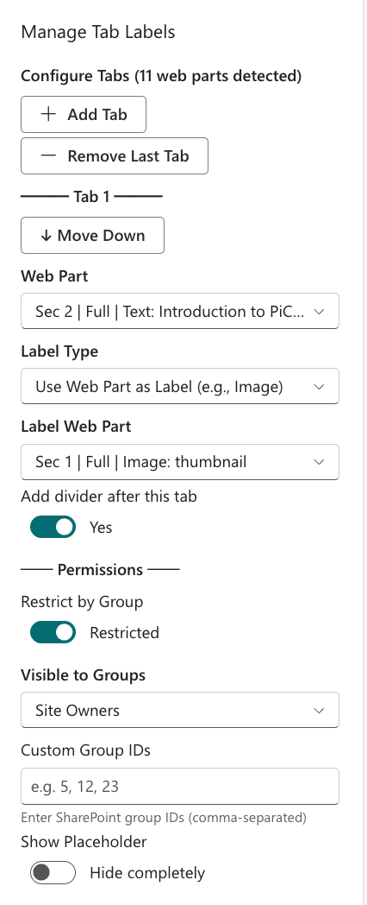

### How It Works

PiCanvas can show or hide individual tabs based on the current user's SharePoint group membership. When permission checking is enabled for a tab, only users in the specified groups will see that tab. This enables personalized experiences without duplicating content.

### Permission Logic

```
┌─────────────────────────────────────────────────────────┐
│ User Opens Page                                         │
├─────────────────────────────────────────────────────────┤
│ 1. Load user's group memberships (cached 5 min)         │
│ 2. For each tab with permissions enabled:               │
│    → Check if user is in ANY specified group (OR logic) │
│    → Show tab if member, hide if not                    │
│ 3. Tabs without permissions → visible to everyone       │
└─────────────────────────────────────────────────────────┘
```

### Supported Groups

| Group Type | Description |
|------------|-------------|
| **Site Owners** | Users with full control of the site |
| **Site Members** | Users with contribute permissions |
| **Site Visitors** | Users with read-only access |
| **Custom Group IDs** | Any SharePoint group by ID number |

### Quick Presets

The property pane offers convenient presets for common scenarios:

| Preset | Groups Included |
|--------|-----------------|
| Everyone | No restriction (default) |
| Site Owners | Owners only |
| Site Members | Members only |
| Site Visitors | Visitors only |
| Owners & Members | Owners + Members |
| Members & Visitors | Members + Visitors |
| All Site Groups | Owners + Members + Visitors |

### Custom Group IDs

For advanced scenarios, enter SharePoint group IDs directly:
- Find group IDs in SharePoint: `/_layouts/15/groups.aspx`
- Enter as comma-separated values: `5, 12, 23`
- Custom IDs work alongside standard group selections

### Visibility Behavior

| Option | What Happens |
|--------|--------------|
| **Hide completely** | Tab is invisible to unauthorized users |
| **Show Placeholder** | Tab appears grayed out with lock icon |

### How to Configure

1. Open the configuration panel and expand any tab's **Permissions** section
2. Enable **"Restrict by Group"** toggle
3. Select groups from the **"Visible to Groups"** dropdown
4. Optionally add custom group IDs
5. Choose visibility behavior (hide or placeholder)
6. Save changes - permissions apply immediately

### Performance & Reliability

- **5-minute cache** - Group data is cached to minimize API calls
- **Pre-loaded on init** - Permissions load in background for fast first render
- **Graceful fallback** - If API fails, all tabs remain visible (fail-open)
- **Template support** - Permission settings export/import with templates

### Use Cases

- **Admin tabs** - Show management tools only to Owners
- **Member features** - Display collaboration tools to Members
- **Public content** - Keep some tabs visible to all, hide others
- **Department pages** - Target content to specific security groups

---

## Content Types

PiCanvas supports 11 content types that let you create rich tab content without adding extra web parts. The most commonly used custom types are documented below.

### Markdown Content

Write beautifully formatted text using simple, readable syntax.

#### Basic Syntax

| Element | Syntax | Output |
|---------|--------|--------|
| Heading 1 | `# Heading` | Large title |
| Heading 2 | `## Heading` | Section title |
| Bold | `**bold**` | **bold** |
| Italic | `*italic*` | *italic* |
| Link | `[text](url)` | [text](#) |
| Image | `` | Image |
| Code | `` `code` `` | `code` |

#### Lists

```markdown
- Bullet item
- Another item
  - Nested item

1. First step
2. Second step
3. Third step

- [x] Completed task
- [ ] Incomplete task
```

#### Tables

```markdown
| Name | Role | Status |
|------|------|--------|
| Alice | Developer | Active |
| Bob | Designer | Active |
```

#### Code Blocks

````markdown
```javascript
function hello() {
  return 'Hello World!';
}
```
````

### HTML Content

Use custom HTML for advanced layouts with inline styling.

#### Allowed Elements

- **Structure:** `div`, `span`, `section`, `article`, `header`, `footer`
- **Text:** `p`, `h1-h6`, `strong`, `em`, `b`, `i`, `u`
- **Lists:** `ul`, `ol`, `li`
- **Tables:** `table`, `thead`, `tbody`, `tr`, `th`, `td`
- **Media:** `img`, `figure`, `video`
- **Links:** `a` (with `href`, `target`, `rel`)

#### Sample: Info Cards

```html
<div style="display: grid; grid-template-columns: repeat(auto-fit, minmax(200px, 1fr)); gap: 16px;">
  <div style="background: linear-gradient(135deg, #667eea 0%, #764ba2 100%); color: white; padding: 20px; border-radius: 12px;">
    <h3 style="margin: 0 0 8px;">📊 Analytics</h3>
    <p style="margin: 0; opacity: 0.9;">View dashboard reports</p>
  </div>
</div>
```

#### Security

- `<script>` tags are completely removed
- Event handlers (`onclick`, `onerror`, etc.) are stripped
- All HTML is sanitized using DOMPurify

### Embed (iframe) Content

Embed videos, apps, dashboards, and external content securely.

#### Trusted Domains

| Category | Domains |
|----------|---------|
| **Video** | YouTube, Vimeo, Microsoft Stream |
| **Microsoft 365** | SharePoint, OneDrive, Sway, Loop, Teams |
| **Power Platform** | Power BI, Power Apps, Power Automate |
| **Forms** | Microsoft Forms, Typeform, Calendly |
| **Design** | Canva, Figma, Miro, Lucidchart |
| **Productivity** | Notion, Airtable, Coda, Mural |

#### Custom Domains

To embed content from domains not in the built-in list, add them in the configuration panel under **Advanced > Embed Security > Custom Embed Domains**. Enter comma-separated domain names (e.g. `myapp.example.com, internal.corp.net`). These are added to the allowlist alongside the built-in trusted domains.

#### Getting Embed URLs

**YouTube:**
```
https://www.youtube.com/embed/VIDEO_ID
```

**Power BI:**
```
https://app.powerbi.com/reportEmbed?reportId=...
```

**Microsoft Forms:**
```
https://forms.office.com/Pages/ResponsePage.aspx?id=...
```

### Mermaid Diagrams

Create professional diagrams using simple text syntax. 20+ diagram types supported!

#### Flowchart

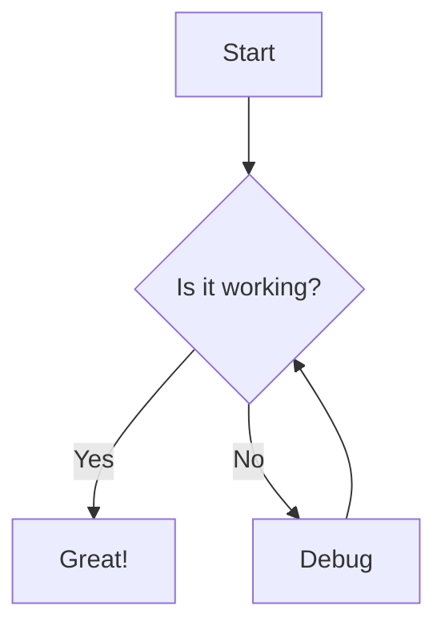

#### Sequence Diagram

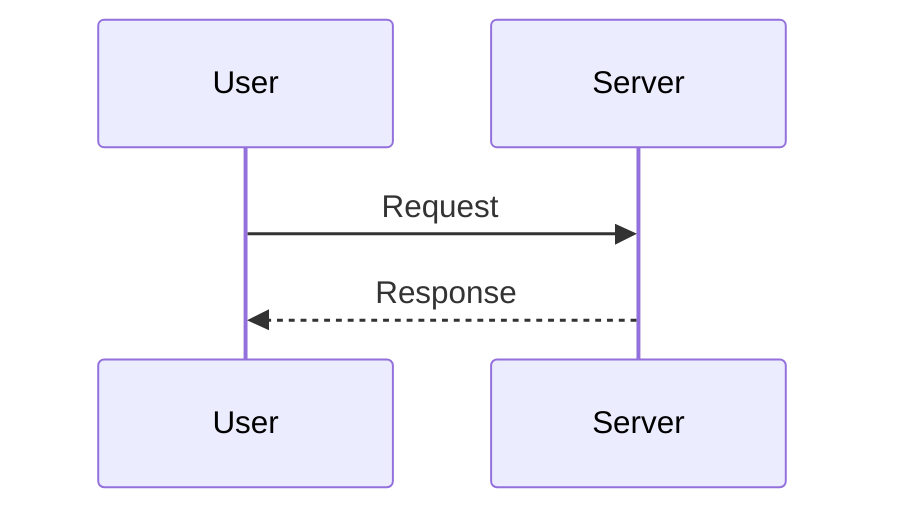

#### Class Diagram

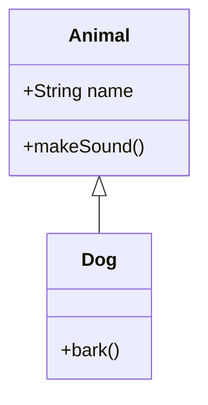

#### State Diagram

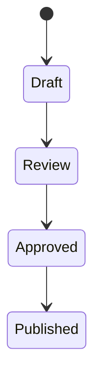

#### Entity Relationship Diagram

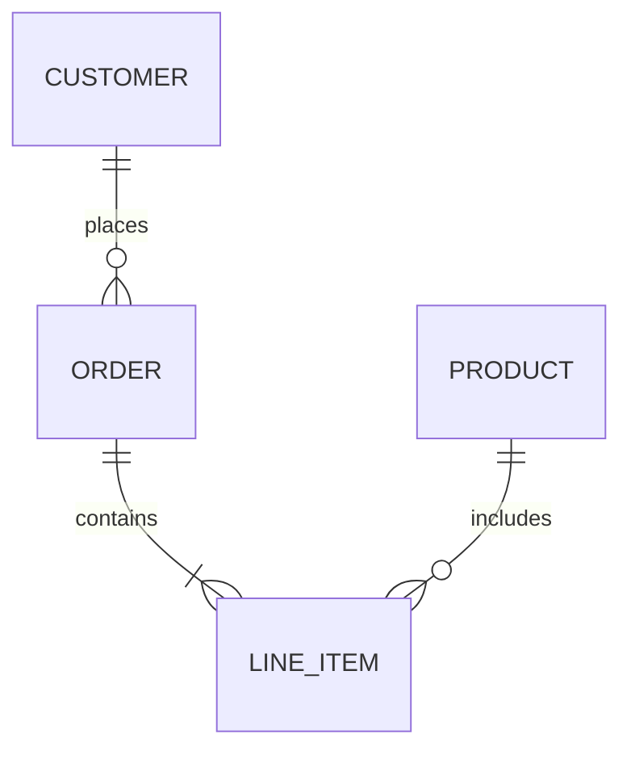

#### Gantt Chart

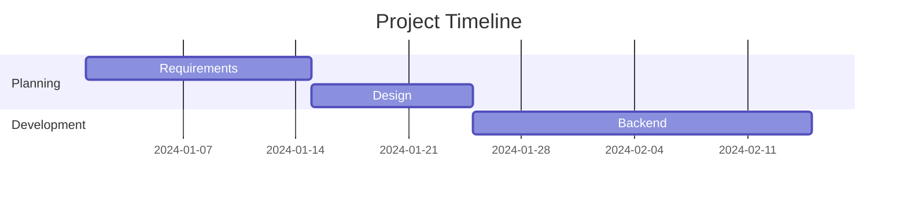

#### Pie Chart

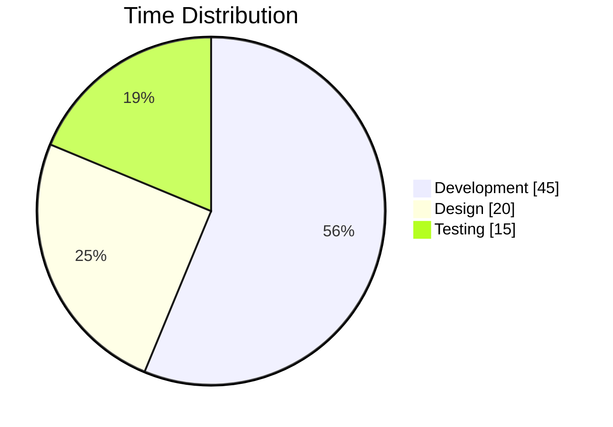

#### Mind Map

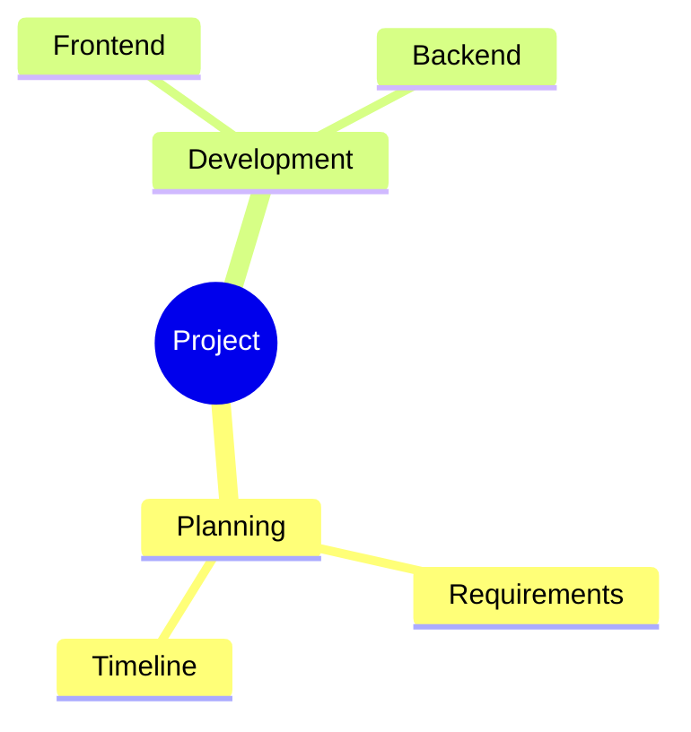

#### Timeline

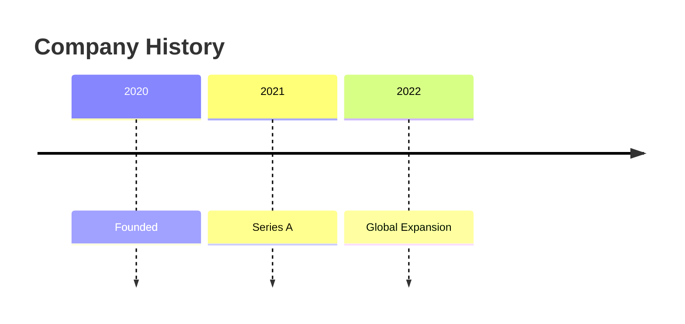

#### Kanban Board

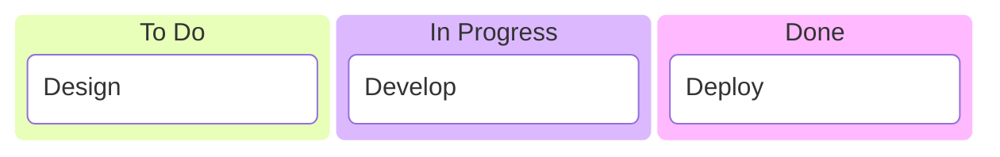

#### More Diagram Types

- **Quadrant Chart** - Priority matrices
- **Git Graph** - Branching visualization
- **Architecture Diagram** - System design
- **XY Chart** - Line and bar charts
- **Sankey Diagram** - Flow visualization
- **Block Diagram** - Simple blocks
- **Radar Chart** - Multi-dimensional comparison

#### Resources

- [Mermaid Official Documentation](https://mermaid.js.org/)
- [Mermaid Live Editor](https://mermaid.live/) - Test diagrams online

---

## Templates

Save and share PiCanvas configurations across sites.

The Templates section in the configuration panel shows built-in templates (Dashboard, Documentation, Team Site), saved templates, and action buttons for Apply, Save Current, Export, and Import.


### How to Use Templates

1. Open the configuration panel and navigate to **Templates**
2. Select a built-in template to apply it
3. Use the export/import controls to download or load a JSON template
4. Optionally save templates to Site Assets for team reuse

### Built-in Templates

| Template | Tabs | Style | Description |
|----------|------|-------|-------------|
| **Classic** | 3 | Default | Simple horizontal tabs |
| **Dashboard** | 4 | Underline | Metrics-focused layout |
| **Navigation Dock** | 5 | Pills | Vertical sidebar |
| **Portal Hub** | 4 | Boxed | Department categories |
| **Minimal** | 3 | Underline | Light, clean design |

### Template Features

- **Export to JSON** - Download complete configuration as JSON file
- **Import from JSON** - Load configuration from JSON file
- **Save to Site Assets** - Store templates in SharePoint for team sharing
- **Includes all settings** - Tab labels, icons, images, permissions, styling, colors
- **Content mapping preserved** - Web part assignments stay with templates
- **Dark Mode preset** - Pre-configured dark theme

---

## Installation

### Prerequisites

- SharePoint Online or SharePoint 2019+
- Site Collection Administrator permissions (for Site Collection App Catalog)
- Tenant Administrator permissions (for Tenant App Catalog)

### Deploy to SharePoint

Prebuilt packages are not provided; build the `.sppkg` locally.

1. Build the package from source:
   - `npm install`
   - `npx heft build --production`
   - `npx heft package-solution --production`
2. Upload `sharepoint/solution/pi-canvas.sppkg` to your **App Catalog** > **Apps for SharePoint**
3. Click **Deploy** when prompted
4. Add the app to your site from **Site Contents > New > App**

### Guest User Access

> **Important:** If you have **guest users** (external users) who need to use PiCanvas, you must deploy to a **Site Collection App Catalog** instead of the Tenant App Catalog.

| Deployment Location | Internal Users | Guest Users |
|---------------------|----------------|-------------|
| **Tenant App Catalog** | ✅ Works | ❌ `[object Object]` error |
| **Site Collection App Catalog** | ✅ Works | ✅ Works |

**Why?** Guest users cannot access tenant-level CDN resources where SPFx assets are hosted. Deploying to a site collection app catalog serves assets from the site's context, which guests can access.

---

## Architecture & Deployment

This section explains how PiCanvas works under the hood — what it does to the page DOM, why, and how it stays safe. It's intended for administrators evaluating PiCanvas for deployment and developers maintaining it.

### How PiCanvas Works

PiCanvas reorganizes existing SharePoint page content into a tabbed layout at render time. It does not modify, replace, or intercept web part data — it moves the rendered DOM elements into tab containers so users see one tab at a time instead of a long scrolling page.

The render lifecycle has three phases:

```
┌─────────────────────────────────────────────────────────────────────┐
│                     PiCanvas Render Lifecycle                       │
├─────────────────────────────────────────────────────────────────────┤
│                                                                     │
│  Phase 1: Pre-Hide (before page paint)                              │
│  ┌───────────────────────────────────────────────────────────────┐  │
│  │ Application Customizer (PiCanvasLoader)                       │  │
│  │  • Reads localStorage for connected web part IDs              │  │
│  │  • Injects <style> at top of <head> with display:none rules   │  │
│  │  • Rules gated by body.picanvas-hiding-active class           │  │
│  └───────────────────────────────────────────────────────────────┘  │
│                            ↓                                        │
│  Phase 2: Instance Hiding (WebPart onInit)                          │
│  ┌───────────────────────────────────────────────────────────────┐  │
│  │ PiCanvas WebPart onInit()                                     │  │
│  │  • Injects per-instance <style> with visibility:hidden rules  │  │
│  │  • Toggles body.picanvas-hiding-active in Read mode           │  │
│  │  • Removes hiding class in Edit mode (web parts stay visible) │  │
│  └───────────────────────────────────────────────────────────────┘  │
│                            ↓                                        │
│  Phase 3: Tab Render (WebPart render)                               │
│  ┌───────────────────────────────────────────────────────────────┐  │
│  │ PiCanvas WebPart render()                                     │  │
│  │  • Scaffolds tab container with role="tabs" accessibility     │  │
│  │  • Moves web part elements into their assigned tab panels     │  │
│  │  • Writes connected IDs to localStorage (for next page load)  │  │
│  │  • Removes pre-hide styles → web parts visible in tabs        │  │
│  └───────────────────────────────────────────────────────────────┘  │
│                                                                     │
└─────────────────────────────────────────────────────────────────────┘
```

**Why two hiding phases?** The Application Customizer runs before any web part initializes, preventing the brief flash of unhidden content on page load. The web part's own hiding handles first-time visits (before localStorage data exists) and ensures per-instance correctness.

### DOM Manipulation Approach

SharePoint does not provide a native API for reorganizing web parts into tabs or alternative layouts at render time. PiCanvas uses direct DOM manipulation to achieve this, following responsible practices:

| Principle | How PiCanvas implements it |
|-----------|---------------------------|
| **Defensive coding** | All DOM operations wrapped in try/catch blocks. Element existence is checked before every move or query. |
| **Non-destructive** | Web parts are moved (not modified or recreated). Their internal state, event handlers, and data bindings remain intact. |
| **Fail-safe** | If any operation fails, the page still works — content simply appears unhidden in its original layout. |
| **Reversible** | Removing PiCanvas from a page restores the original layout with no residual changes. |
| **Edit-mode aware** | In Edit mode, PiCanvas removes all hiding classes and styles so authors see the standard SharePoint editing experience. |

When multiple PiCanvas instances exist on the same page, a global registry tracks which instance owns each web part. If a web part is already claimed by another instance, PiCanvas creates a deep clone (with suffixed IDs to avoid conflicts) rather than fighting for the original element.

### Application Customizer (PiCanvasLoader)

The PiCanvasLoader Application Customizer is an optional but recommended companion to the PiCanvas web part. Its sole purpose is to inject CSS that hides configured web parts before the page renders, preventing a flash of unstyled content.

| Aspect | Detail |
|--------|--------|
| **What it does** | Injects a `<style>` element at the top of `<head>` with `display: none !important` rules for configured web parts |
| **How it coordinates** | Reads the `picanvas-connected-webparts` localStorage key, which the web part writes during render |
| **Body class gating** | All hiding rules are scoped under `body.picanvas-hiding-active`, so they only take effect when the web part activates them in Read mode |
| **Security** | Every ID from localStorage is passed through `CSS.escape()` before being used in a selector, preventing CSS injection |
| **Failure behavior** | Entire injection is wrapped in try/catch — if it fails, the page loads normally (with a brief content flash) |

**When to deploy:** Without the Application Customizer, PiCanvas still works perfectly — users will just see a brief flash of all web parts before they're moved into tabs. For production sites, deploying the customizer provides a polished loading experience.

### Content Security

PiCanvas handles user-authored content (Markdown, HTML, embeds) and applies multiple layers of sanitization:

| Layer | Implementation |
|-------|---------------|
| **HTML sanitization** | All Markdown and HTML content is processed through [DOMPurify](https://github.com/cure53/DOMPurify) before rendering. `<script>` tags and event handler attributes (`onerror`, `onload`, `onclick`, etc.) are explicitly forbidden. |
| **CSS selector escaping** | All dynamic values used in CSS selectors pass through `CSS.escape()` to prevent injection from localStorage or web part properties. |
| **Embed domain allowlist** | Embed URLs must use HTTPS and match a curated allowlist of 50+ trusted domains (YouTube, Power BI, Microsoft Forms, Figma, etc.). Administrators can extend the allowlist via the web part property pane. Unrecognized domains are blocked with a visible error message. |
| **Iframe sandboxing** | Embedded iframes use `sandbox="allow-scripts allow-same-origin allow-forms allow-popups allow-presentation"` with `referrerpolicy="no-referrer-when-downgrade"`. |
| **HTML entity encoding** | Tab labels, error messages, and any user-supplied strings injected into HTML are entity-encoded (`&`, `<`, `>`, `"`, `'`) before insertion. |
| **No inline script execution** | PiCanvas never evaluates user-supplied strings as JavaScript. Content rendering is strictly HTML-only. |

### Enterprise Deployment Considerations

| Topic | Detail |
|-------|--------|
| **App catalog approval** | PiCanvas is a standard SPFx solution ("full trust client-side") that runs under the current user's context. It requires SharePoint Admin approval in the App Catalog. |
| **Tenant-wide vs site-scoped** | Can be deployed tenant-wide (available on all sites) or to individual Site Collection App Catalogs. Site collection deployment is required for guest user access (see [Guest User Access](#guest-user-access)). |
| **CDN dependencies** | All assets are bundled in the `.sppkg` file. There are no external CDN dependencies — PiCanvas works in air-gapped and restricted network environments. |
| **Guest users** | Guest users require deployment to a Site Collection App Catalog. See [Guest User Access](#guest-user-access) above for details. |
| **Removing PiCanvas** | Removing the web part from a page restores the original layout immediately. Uninstalling the solution leaves no residual DOM changes, localStorage entries, or other artifacts. The Application Customizer's hiding styles become inert (no matching body class) and are cleaned up on the next page load. |
| **Multiple instances** | Multiple PiCanvas web parts can coexist on the same page. Each instance tracks its own web parts and coordinates with others via a shared registry to avoid conflicts. |

### What Happens If SharePoint Changes

PiCanvas targets stable SharePoint selectors — primarily `data-automation-id` attributes (`CanvasZone`, `CanvasSection`, `CanvasControl`) and web part element IDs, which have remained consistent across SharePoint updates. Additionally, the section and web part selectors are configurable in the property pane, allowing administrators to adapt to layout changes without code modifications.

If a selector stops matching:

1. **Tabs render empty** — the affected web parts simply don't appear in their tab panels
2. **Content falls back to unhidden** — the pre-hide CSS targets specific IDs, so unmatched elements remain visible in their original positions
3. **No SharePoint functionality is blocked** — PiCanvas never intercepts clicks, network requests, or SharePoint APIs

**Recommendation for production deployments:** After SharePoint tenant updates, spot-check PiCanvas pages to verify web parts still appear in their tabs. The Troubleshooting section below provides diagnostic tools for identifying selector mismatches.

---

## Troubleshooting

The Advanced section in the configuration panel provides diagnostic tools when web parts aren't detected correctly. It includes CSS selector overrides, global lock defaults, embed security settings (custom domain allowlist), and a Reset All Styles button.

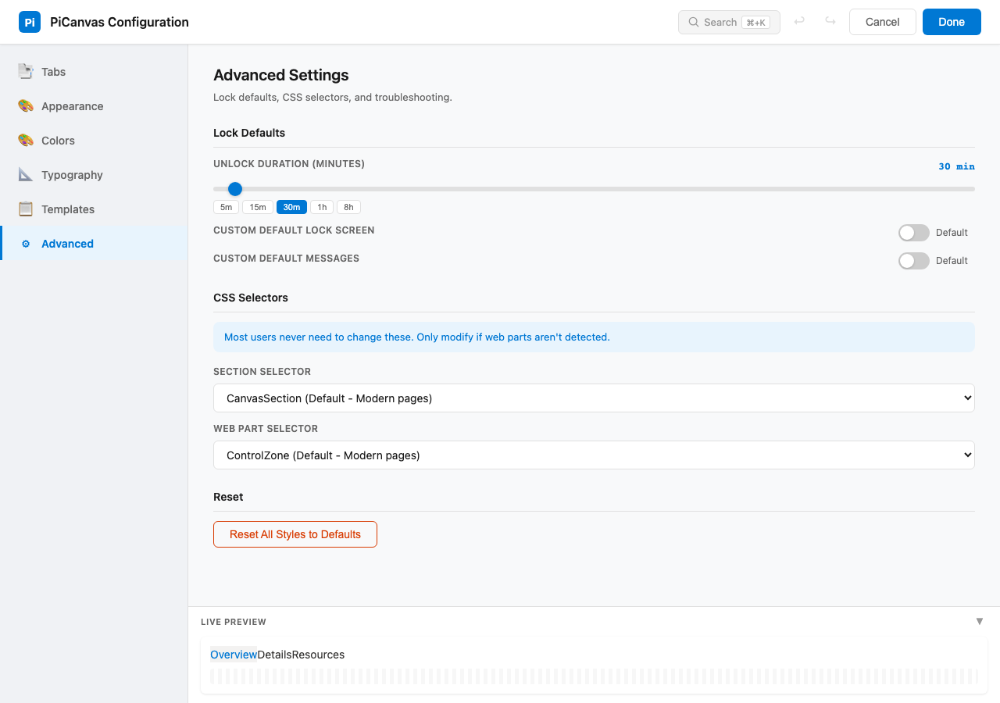

### Web Parts Not Detected

**Symptom:** Dropdown shows no web parts or wrong web parts

**Solution:**
1. Open property pane > scroll to **Troubleshooting**
2. Try different **Section Selector** options:
   - `CanvasSection` (default for modern pages)
   - `CanvasZone` (older page layouts)
   - `webpart` (generic fallback)
3. Try different **Web Part Selector** options:
   - `ControlZone` (default)
   - `webpart-container`
   - `data-sp-feature-instance-id`
4. Click **Reset to Defaults** if things get stuck

### Permission Filtering Not Working

**Symptom:** Restricted tabs visible to everyone

**Possible causes:**
1. **API delay** - Wait a moment, permissions load asynchronously
2. **Cache** - Group data cached 5 minutes, wait or reload
3. **Guest users** - Must use Site Collection App Catalog deployment
4. **API failure** - Check browser console for errors (fails open by design)

### Guest User Issues

**Symptom:** Guest users see `[object Object]` error

**Solution:** Deploy to **Site Collection App Catalog** instead of Tenant App Catalog.

### Styles Not Applying

**Symptom:** Custom colors or styles not showing

**Solutions:**
1. Check theme mode (Light/Dark) matches your settings
2. Click **Reset All Styles** in Troubleshooting section
3. Ensure no conflicting page-level CSS
4. Try a different browser to rule out cache issues

---

## Customization Settings

### Colors

The Colors section in the configuration panel provides theme presets (Dashboard, Documentation) and individual color pickers for Accent Color, Tab Text Color, Active Tab Text, Tab Background, Active Tab Background, Hover Background, Indicator Color, and Separator Color. Each setting has a color swatch preview, hex input field, and quick-pick palette.

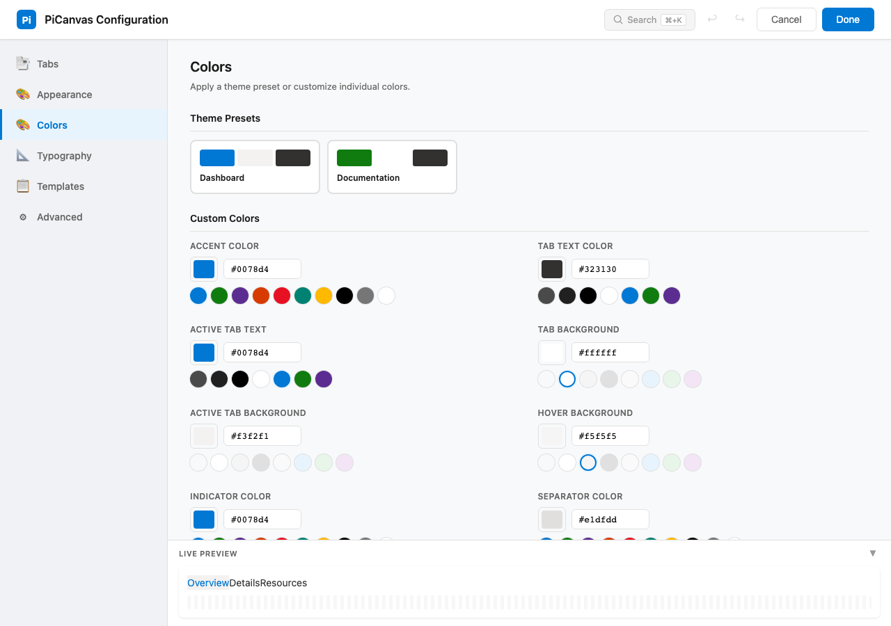

| Setting | Description |
|---------|-------------|
| **Accent Color** | Primary color for active states |
| **Tab Text Color** | Inactive tab text |
| **Active Tab Text Color** | Selected tab text |
| **Tab Background** | Inactive tab background |
| **Active Tab Background** | Selected tab background |
| **Hover Background** | Tab background on mouse hover |

### Typography & Spacing

The Typography section in the configuration panel contains sliders for Font Size (12-20px), Font Weight (400-700), Vertical Padding, Horizontal Padding, Gap Between Tabs, Content Gap, Corner Radius, and Active Indicator Width. Each slider shows the current value with quick-pick presets and updates the live preview in real-time.

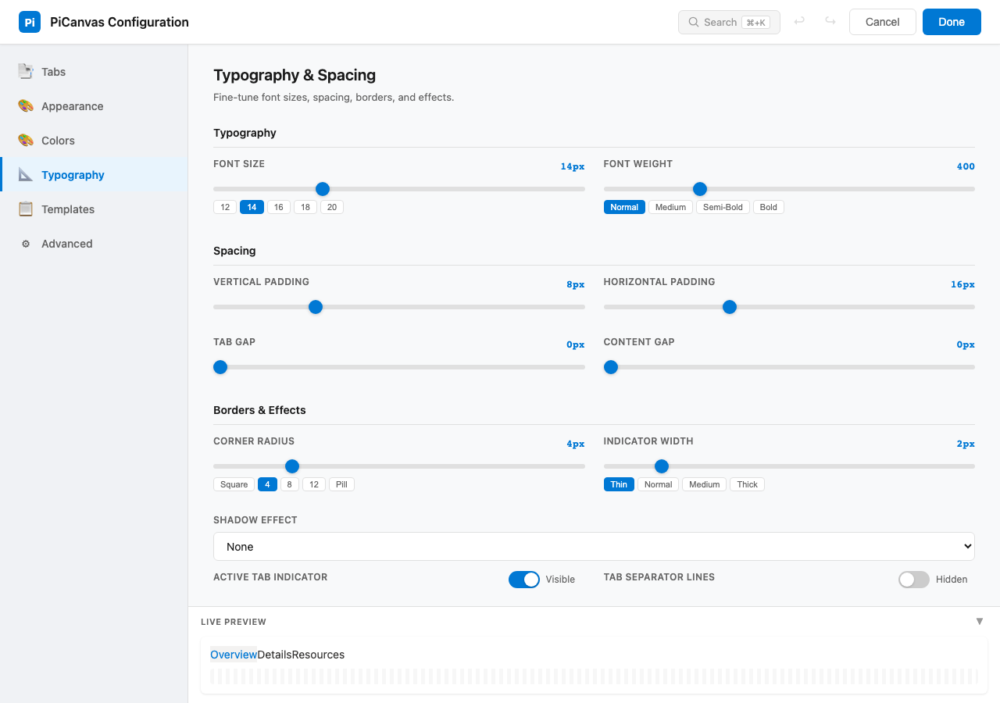

| Setting | Range | Default |
|---------|-------|---------|
| **Font Size** | 12px - 20px | 14px |
| **Font Weight** | 400 - 700 | 500 |
| **Vertical Padding** | 6px - 20px | 12px |
| **Horizontal Padding** | 10px - 40px | 20px |
| **Gap Between Tabs** | 0px - 20px | 0px |

### Borders & Effects

The Borders & Effects settings are in the Typography section (scroll down). They include Corner Radius, Active Indicator Width, Shadow Effect presets, and toggles for Show Tab Separators and Enable Animations.


| Setting | Options |
|---------|---------|
| **Corner Radius** | 0px - 16px |
| **Active Indicator Width** | 2px - 6px |
| **Active Indicator Color** | Accent color or custom |
| **Shadow Effect** | None, Subtle, Medium, Strong |
| **Show Tab Separators** | Toggle separator lines between tabs |
| **Enable Animations** | Toggle smooth transitions |

---

## Additional Resources

- [Main README](../README.md) - Overview and quick start
- [GitHub Issues](https://github.com/anthonyrhopkins/PiCanvas/issues) - Report bugs or request features
- [Contributing Guide](../CONTRIBUTING.md) - Help improve PiCanvas

---

## Credits

PiCanvas is built on [Modern Hillbilly Tabs](http://www.markrackley.net/2022/06/29/the-return-of-hillbilly-tabs/) by Mark Rackley. Modernized and expanded by [@anthonyrhopkins](https://github.com/anthonyrhopkins).
